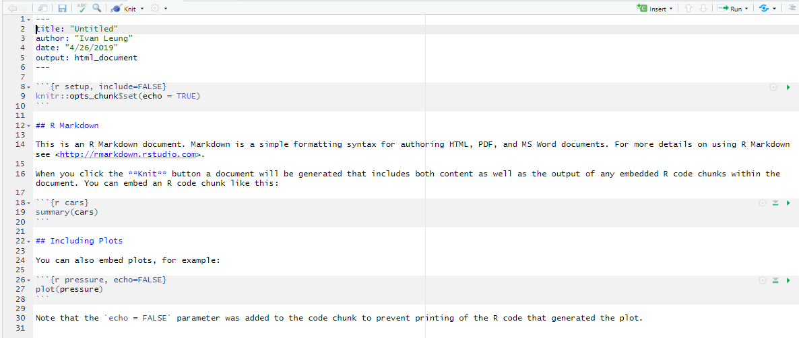
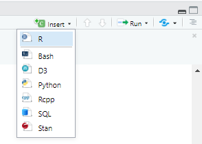
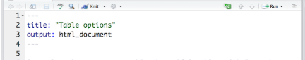
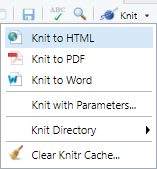

```{r setup, include=FALSE}
library(kableExtra)
library(knitr)
library(tidyverse)
library(rmarkdown)

PrettyTable <- function(data) {
  data %>% 
    kable() %>% 
    kable_styling(bootstrap_options = c("striped", "hover",
                                        "condensed", "responsive"),
                  full_width = FALSE)
}

#Color Format
ColFmt <- function(x, color = 'red') {
  outputFormat <- knitr::opts_knit$get("rmarkdown.pandoc.to")
  if (outputFormat == "latex") {
    paste("\\textcolor{", color, "}{", x, "}", sep = "")
  } else if (outputFormat == "html") {
    paste("<font color='", color, "'>", x, "</font>", sep = "")
  } else {
    x
  }
}

```

# What is R Markdown?
> R Markdown provides an authoring framework for data science. You can use a 
single R Markdown file to both:
>
>- save and execute code
>- generate high quality reports that can be shared with an audience
>
> R Markdown documents are fully reproducible and support dozens of static and 
dynamic output formats
>
>
> Source: [RStudio](https://rmarkdown.rstudio.com/authoring_basics.html){target="_blank"}

# Getting started
```r{eval=FALSE}
install.packages('rmarkdown')
```

## Load the package

```{r library-rmarkdown, echo=TRUE, message=TRUE, warning=TRUE}
library(rmarkdown)
```

# Concepts of R Markdown

## Creating an R Markdown file

Instead of creating a new `.R` script, let's create a new `.Rmd` 
(read `r ColFmt('Rm')`ark `r ColFmt('d')`own).

Go to `File` > `New File` > `R Markdown...`

Enter the desired `Title` and `Author`, and use the default settings for now, 
and click `OK`; all these may be changed later `r emo::ji('wink')`.

A new `.Rmd` will present itself, as per image below.

<center>



</center>

Notice that the file has three general sections:

- A [YAML](https://en.wikipedia.org/wiki/YAML){target="_blank"} header surrounded by `---`s

  + this is where document settings (e.g., Title, Output Format) may be tweaked

- code chunks surrounded by ` ``` `s

  + the `r` in the `{r}` indicates that this chunks is written as R code, but 
  R Markdown allows for other languages (e.g., Python)!

- text

## How it works

<center>


</center>

## Code chunks
To insert code chunks:

- use the keyboard shortcut Ctrl + Alt + I (OS X: Cmd + Option + I)

- use the Add Chunk  command in the editor toolbar

- type the chunk delimiters ` ```{r} ` (start) and ` ``` `(end), and insert code
in between

### Chunk options
Chunk output may be customized via the arguments set in the `{}` of a chunk 
header. 

<center>


</center>

The above example show a sample of five arguments available:

- `include = FALSE` prevents code and results from appearing in the finished file. R Markdown still runs the code in the chunk, and the results can be used by other chunks.

- `echo = FALSE` prevents code, but not the results from appearing in the finished file. This is a useful way to embed figures.

- `message = FALSE` prevents messages that are generated by code from appearing in the finished file.

- `warning = FALSE` prevents warnings that are generated by code from appearing in the finished.

- `fig.cap = "..."` adds a caption to graphical results.

For a complete list of arguments, refer to [R Markdown Reference Guide](https://www.rstudio.com/wp-content/uploads/2015/03/rmarkdown-reference.pdf){target="_blank"}

### Global chunk options
In case there are setting(s) (argument(s)) that are to be set globally, we use the
`knitr::opts_chunk$set` in a code chunk (refer to the topmost code chunk in the
example above). Each option passed to `knitr::opts_chunk$set` are treated as a 
global default, **but** may be overwritten in individual chunk headers.

## Inline code
In addition to a code chunk, code results may be inserted directly into the text
section by enclosing the code with `` `r
 `` (start) and `` `
 `` (end), with code in between.

For example, instead of `1 + 1`, do `` `r
1 + 1` ``.

Doing so yields `r 1 + 1`, instead of the actual text `1 + 1`.

## Other code languages
R Markdown supports other languages besides R.

The example below executes code in `bash` and `python`. 

<center>


</center>

Some of the available language engines include:

- Python
- SQL
- Bash
- Rcpp
- Stan
- JavaScript
- CSS

To process a code chunk using an alternate language engine, replace the `r` inside the ` ```{r} ``` ` with the desired language.

For example, 
<br>
` ```{python} \nsome python code\n ``` `

Another option is to use RStudio IDE built-in button:

<center>



</center>

Note that previously mentioned chunk options are still valid when using other 
languages.

## Tables
By default, R Markdown displays data frames and matrixes as per their output in
R terminal.

For a prettier formatting, such as the example below, there's the `knitr::kable()` 
function.

<center>


</center>

Alternatively, there are other packages that allows custom formatting of tables 
(refer to **Extra Resources** section below).

Note the use of the ` results='asis'` chunk option. This is required to ensure 
that the raw table output isn’t processed further by `knitr`.

## Formatting Text
Text formatting in R Markdown follows [Pandoc's Markdown](https://rmarkdown.rstudio.com/authoring_pandoc_markdown.html){target="_blank"}.

Some examples: 
<br>
Add an horizontal line by adding 3 stars:
```{r, eval=FALSE}
***
```

***

Make a text bold by adding enveloping it around ` ** `
```{r, eval=FALSE}
**some text**
```

**some text**

And even equations!
```{r, eval=FALSE}
$KE = \frac{1}{2}mv^2$
```

$KE = \frac{1}{2}mv^2$

Note that hovering over the inline equations in `.Rmd` file displays a preview too!

Read more at [Pandoc’s Markdown](https://rmarkdown.rstudio.com/authoring_pandoc_markdown.html){target="_blank"} or refer to the useful [R Markdown Cheatsheet](https://www.rstudio.com/wp-content/uploads/2016/03/rmarkdown-cheatsheet-2.0.pdf){target="_blank"}

## Output formats
To generate output, use:

1. `rmarkdown::render()`
2. RStudio IDE built-in  button 

### Option 1
Set the `output_format` argument of `render()` to any of 
RMarkdown’s supported formats (e.g., HTML, PDF). 

For example, the code below renders `1-example.Rmd` to a Microsoft Word document.

```{r eval=FALSE}
rmarkdown::render("1-example.Rmd", output_format = "word_document")
```

If no format is selected, R Markdown renders the file to its default format, 
which is set in the `output` field of a `.Rmd` file’s 
[YAML](https://en.wikipedia.org/wiki/YAML) header. Recall that `YAML` settings 
are enclosed in `--- some settings ---` section.

Notice that the header of `1-example.Rmd` above shows that it renders to an HTML file 
by default - `output: html_document`.

<center>



</center>

### Option 2
When clicking the  button, the RStudio IDE renders
a file to the first format listed in its output field. For the above example, it 
will be HTML.

Additional formats are available by clicking the dropdown menu beside the knit button:

<center>



</center>

Read more about the available output formats and header options (e.g., table of 
contents) in [Output Formats](https://rmarkdown.rstudio.com/lesson-9.html){target="_blank"}.

# Extra Resources

The above intro is but a tiny fraction of all the gems and power of R Markdown!

Below are useful guides from RStudio to advance your knowledge further `r emo::ji('nerd_face')`

- [R Markdown getting started guide](https://rmarkdown.rstudio.com/lesson-1.html){target="_blank"}
- [R Markdown reference guide](https://www.rstudio.com/wp-content/uploads/2015/03/rmarkdown-reference.pdf){target="_blank"}
- [R Markdown cheatsheet](https://www.rstudio.com/wp-content/uploads/2016/03/rmarkdown-cheatsheet-2.0.pdf){target="_blank"}
- [R Markdown book](https://bookdown.org/yihui/rmarkdown/){target="_blank"}


## Pretty Tables

- `kableExtra`: <http://haozhu233.github.io/kableExtra/>{target="_blank"}

# Credits

<center>
<font size="4">
@RStudio <br>
https://github.com/rstudio/rmarkdown <br>
</font>
</center>

